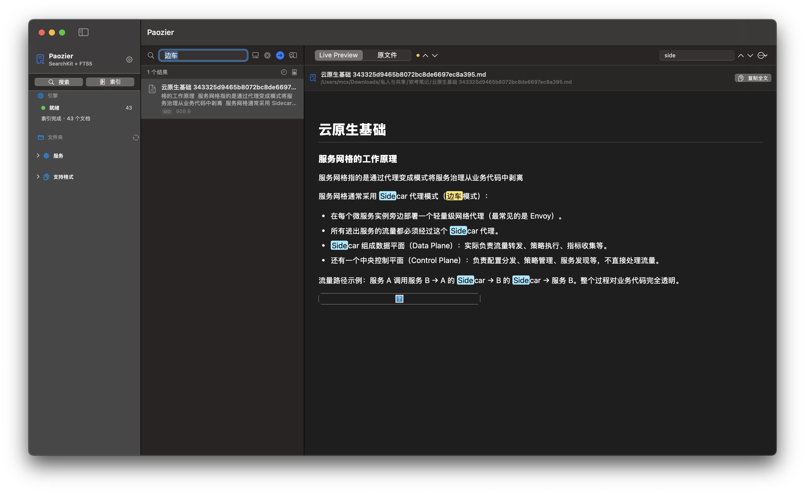
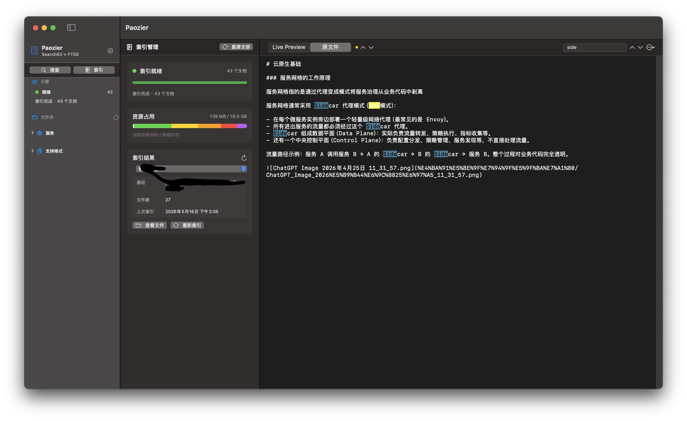

# 🦌 Paozier

> **"狍子"（páo zi）** — 森林中可爱又充满好奇心的小鹿，总能在密林深处找到它想要的东西。
>
> **"Paozier"** comes from "páo zi" (roe deer) — the cute, curious forest deer that always finds what it's looking for in the woods.

---

macOS 本地全文搜索客户端，基于 Apple SearchKit + SQLite FTS5 双引擎，像狍子一样灵敏地在你的文件森林中找到一切。

A native macOS full-text search client powered by Apple SearchKit + SQLite FTS5 dual engines — sniffing out everything in your file forest like a roe deer.


搜索界面



支持查看索引结果：



## ✨ 功能特性 / Features

- 📂 选择本地文件夹，自动扫描并索引 / Select local folders, auto-scan and index
- 🔍 SearchKit + FTS5 双引擎融合搜索，支持中英文 / Dual-engine search with CJK support
- 🖍️ 搜索结果高亮匹配片段（Live Preview）/ Highlighted search snippets
- 👁️ 内置多格式预览（PDF / QuickLook / 文本）/ Built-in multi-format preview
- ⚡ 增量索引，多文件夹管理 / Incremental indexing, multi-folder management
- 🌐 内置 HTTP 搜索服务（端口 9880）/ Built-in HTTP search service (port 9880)
- 🤖 内置 MCP 服务器（端口 9881），供 AI 工具集成 / Built-in MCP server for AI tool integration
- 📋 搜索历史、书签、报告收集 / Search history, bookmarks, reports

## 📄 支持格式 / Supported Formats

PDF · Word (docx) · Excel (xlsx) · PowerPoint (pptx) · RTF · HTML · TXT · Markdown · JSON · XML · CSV · EPUB · 代码文件 / Code (swift/py/js/ts/java/c/cpp/rs/go …)

## 🛠️ 技术栈 / Tech Stack

| 组件 / Component | 说明 / Description |
|---|---|
| SwiftUI | macOS 14+ 原生应用 / Native app |
| Apple SearchKit | TF-IDF 相关性排序 / Relevance ranking |
| SQLite FTS5 | CJK 全文索引 / CJK full-text indexing |
| Network.framework | 轻量 HTTP/TCP 服务器 / Lightweight server |
| PDFKit + QuickLook | 文件预览 / File preview |

## 🚀 安装与运行 / Installation & Usage

### 前置条件 / Prerequisites

- macOS 14 (Sonoma) 或更高版本 / or later
- Xcode 15+ (含 Swift toolchain)

### 构建运行 / Build & Run

```bash
# 克隆项目 / Clone
git clone https://github.com/user/paozier.git
cd paozier

# 构建 / Build
swift build

# 运行（自动启动 HTTP:9880 和 MCP:9881 服务）
# Run (auto-starts HTTP:9880 and MCP:9881 services)
swift run Paozier
```

无需安装 Java、Solr 或任何外部依赖。
No Java, Solr, or external dependencies required.

### 基本使用 / Basic Usage

1. 启动应用后，点击侧边栏 "+" 添加文件夹 / Launch the app, click "+" in sidebar to add folders
2. 等待索引完成 / Wait for indexing to complete
3. 在搜索栏输入关键词即可搜索 / Type keywords in the search bar to search
4. 点击结果查看预览和高亮片段 / Click results to preview with highlighted snippets

### HTTP API

```bash
# 状态 / Status
curl http://localhost:9880/api/status

# 搜索 / Search
curl "http://localhost:9880/api/search?q=关键词"

# 网页界面 / Web UI
open http://localhost:9880
```

### MCP Server

通过 JSON-RPC 2.0 协议与 AI 工具集成 / Integrate with AI tools via JSON-RPC 2.0:

```bash
# 搜索文档 / Search documents
echo '{"jsonrpc":"2.0","id":1,"method":"tools/call","params":{"name":"search_documents","arguments":{"query":"全文搜索"}}}' | nc localhost 9881
```

可用工具 / Available tools: `search_documents` · `get_document_content` · `index_folder` · `list_indexed_folders` · `index_status` · `list_files` · `get_file_info` · `remove_folder` · `reindex_all`

## 📁 数据存储 / Data Storage

运行时数据位于 / Runtime data at `~/Library/Application Support/Paozier/`:

| 文件 / File | 用途 / Purpose |
|---|---|
| `searchkit.index` | SearchKit 索引 / index |
| `fts.db` | SQLite FTS5 数据库 / database |
| `folders.json` | 已索引文件夹 / Indexed folders |
| `history.json` | 搜索历史 / Search history |
| `bookmarks.json` | 书签 / Bookmarks |
| `compendium.json` | 报告 / Reports |

## 📜 License

MIT
